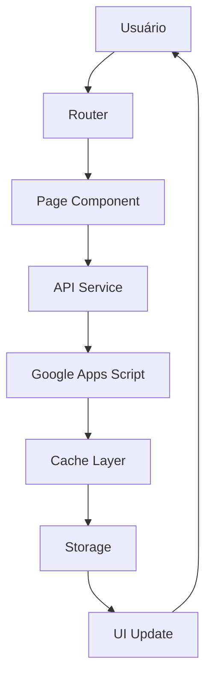

# 🎵 Louvor CEVD - SPA v2.0

## 📋 Visão Geral

Sistema de Gestão do Ministério de Louvor construído como **Single Page Application (SPA)** com arquitetura moderna, componentes reutilizáveis e performance otimizada.

---

## 🏗️ Estrutura do Projeto

```
Louvor/
├── 📁 src/                          # Código fonte principal
│   ├── 📁 components/               # Componentes reutilizáveis
│   │   ├── sidebar.js              # Navegação lateral
│   │   ├── header.js               # Cabeçalho principal
│   │   ├── loading.js              # Sistema de loading
│   │   └── toast.js                # Sistema de notificações
│   ├── 📁 pages/                   # Páginas do sistema
│   │   ├── dashboard.js            # Dashboard principal
│   │   ├── escalas.js              # Gestão de escalas
│   │   ├── musicas.js              # Gestão de músicas
│   │   ├── equipe.js                # Gestão de equipe
│   │   └── utilitarios.js          # Ferramentas e utilitários
│   ├── 📁 styles/                   # Estilos CSS
│   │   ├── main.css                 # Estilos principais
│   │   ├── components.css          # Estilos dos componentes
│   │   └── pages.css               # Estilos das páginas
│   ├── 📁 utils/                   # Utilitários do sistema
│   │   ├── config.js               # Configuração central
│   │   ├── router.js               # Sistema de roteamento SPA
│   │   ├── storage.js              # Sistema de storage local
│   │   └── api.js                  # Sistema de API e cache
│   └── app.js                      # Aplicação principal
├── 📁 old/                         # Arquivos antigos (backup)
├── 📁 assets/                      # Recursos estáticos
├── 📁 Shared/                      # Bibliotecas compartilhadas
├── 📁 docs/                        # Documentação
└── index.html                      # Entry point da aplicação
```

---

## 🚀 Como Usar

### 1. **Acessar o Sistema**

```bash
# Acessar via navegador
http://louvor.test
# ou
http://localhost/Louvor
```

### 2. **Navegação**

- **Dashboard**: Visão geral do ministério
- **Escalas**: Gerenciamento completo de escalas
- **Músicas**: Repertório e acervo musical
- **Equipe**: Gestão de membros e participação
- **Utilitários**: Ferramentas e recursos

### 3. **Funcionalidades Principais**

#### 🔄 **Sincronização Automática**
- Dados sincronizados em tempo real
- Cache offline para funcionamento sem internet
- Backup automático no localStorage

#### 🎨 **Temas Personalizáveis**
- 5 temas disponíveis (light, dark, blue, green, purple)
- Mudança instantânea com animações suaves
- Persistência da preferência do usuário

#### 📱 **Totalmente Responsivo**
- Layout adaptativo para desktop, tablet e mobile
- Menu hambúrguer para dispositivos móveis
- Touch-friendly interfaces

---

## 🛠️ Arquitetura e Tecnologias

### **Frontend Framework**
- **Vanilla JavaScript ES6+** - Sem dependências externas
- **SPA Router** - Sistema de roteamento próprio
- **Component System** - Arquitetura baseada em componentes

### **Estilização**
- **Tailwind CSS** - Utility-first CSS framework
- **CSS Custom Properties** - Suporte a temas dinâmicos
- **CSS Grid & Flexbox** - Layouts modernos

### **Armazenamento**
- **LocalStorage** - Dados offline e preferências
- **SessionStorage** - Cache temporário
- **IndexedDB** - (Futuro) Para grandes volumes de dados

### **API e Dados**
- **Google Apps Script** - Backend como serviço
- **RESTful API** - Comunicação padronizada
- **Cache Layer** - Redução de requisições

---

## 📁 Componentes Detalhados

### **Router** (`src/utils/router.js`)
```javascript
// Sistema de roteamento SPA
window.router.register('/dashboard', () => renderDashboard());
window.router.register('/escalas', () => renderEscalas());
// Navegação sem refresh
window.router.navigate('/musicas');
```

### **Storage** (`src/utils/storage.js`)
```javascript
// Sistema de storage com expiração
window.storage.set('user_data', data);
window.storage.get('user_data', defaultValue);
window.storage.setWithExpiry('cache', data, 3600000); // 1h
```

### **API** (`src/utils/api.js`)
```javascript
// Sistema de API com cache
const escalas = await window.api.getEscalas();
const result = await window.api.syncAll(); // Sincronização completa
```

### **Toast** (`src/components/toast.js`)
```javascript
// Sistema de notificações
window.toast.success('Operação concluída!');
window.toast.error('Erro ao processar');
window.toast.warning('Atenção!');
```

---

## 🎨 Sistema de Temas

### **Tema Light (Padrão)**
```css
:root {
    --bg-primary: #f8fafc;
    --text-primary: #1e293b;
    --accent-color: #3b82f6;
}
```

### **Tema Dark**
```css
[data-theme="dark"] {
    --bg-primary: #0f172a;
    --text-primary: #f1f5f9;
    --accent-color: #3b82f6;
}
```

### **Como Criar Novo Tema**
1. Adicionar variáveis CSS em `main.css`
2. Adicionar ao array `THEME.AVAILABLE` em `config.js`
3. Implementar lógica de troca em `components/header.js`

---

## 🔧 Configuração

### **API Configuration** (`src/utils/config.js`)
```javascript
window.APP_CONFIG = {
    API: {
        BASE_URL: 'https://script.google.com/macros/s/...',
        ENDPOINTS: {
            ESCALAS: '?sheet=Transformar',
            REPERTORIO: '?sheet=Repertório_PWA'
        }
    },
    APP: {
        NAME: 'Louvor CEVD',
        VERSION: '2.0.0'
    }
};
```

### **Rotas Disponíveis**
```javascript
ROUTES: {
    HOME: '/',
    DASHBOARD: '/dashboard',
    ESCALAS: '/escalas',
    MUSICAS: '/musicas',
    EQUIPE: '/equipe',
    UTILITARIOS: '/utilitarios'
}
```

---

## 📊 Performance e Otimizações

### **Lazy Loading**
- Componentes carregados sob demanda
- Imagens com lazy loading
- Code splitting por página

### **Cache Strategy**
- **API Cache**: 5 minutos para dados dinâmicos
- **Static Cache**: 1 ano para assets estáticos
- **Service Worker**: (Futuro) Cache offline avançado

### **Bundle Optimization**
- Mínimo de dependências externas
- CSS e JS minificados
- Critical CSS inline

---

## 🔄 Fluxo de Dados



---

## 🐛 Troubleshooting

### **Problemas Comuns**

#### **Página não carrega**
1. Verificar console (F12) para erros
2. Confirmar que `src/app.js` está sendo executado
3. Verificar se todos os arquivos JS existem

#### **Dados não sincronizam**
1. Verificar URL da API em `config.js`
2. Testar acesso ao Google Apps Script
3. Limpar cache e recarregar

#### **Tema não muda**
1. Verificar se `localStorage` está disponível
2. Confirmar CSS custom properties estão definidas
3. Testar em navegador diferente

### **Debug Mode**
```javascript
// Ativar debug no console
window.app.debug = true;
window.router.debug = true;
```

---

## 🚀 Deploy e Produção

### **Build para Produção**
```bash
# Minificar CSS (futuro)
npm run build:css

# Minificar JS (futuro)
npm run build:js

# Otimizar imagens (futuro)
npm run optimize:images
```

### **Configuração de Servidor**
```apache
# .htaccess para SPA
RewriteEngine On
RewriteRule ^(.*)$ index.html [QSA,L]
```

---

## 📱 PWA Features (Futuro)

### **Service Worker**
```javascript
// Cache offline avançado
self.addEventListener('fetch', event => {
    // Estratégia de cache
});
```

### **Web App Manifest**
```json
{
    "name": "Louvor CEVD",
    "short_name": "Louvor",
    "start_url": "/",
    "display": "standalone",
    "background_color": "#f8fafc",
    "theme_color": "#3b82f6"
}
```

---

## 🤝 Contribuição

### **Padrões de Código**
- **JavaScript**: ES6+, camelCase, async/await
- **CSS**: BEM methodology, CSS custom properties
- **HTML**: Semântico, acessibilidade (WCAG)

### **Git Flow**
```bash
# Feature branch
git checkout -b feature/nova-funcionalidade
git commit -m "feat: adicionar nova funcionalidade"
git push origin feature/nova-funcionalidade
# Pull request para main
```

---

## 📞 Suporte e Documentação

### **Documentação Adicional**
- `HOSPEDAGEM_LOCAL.md` - Configuração local
- `API_DOCS.md` - Documentação da API
- `COMPONENT_GUIDE.md` - Guia de componentes

### **Canais de Suporte**
- Issues no GitHub para bugs
- Wiki para documentação detalhada
- Code review para contribuições

---

## 🎯 Roadmap Futuro

### **v2.1** (Próximo)
- [ ] Service Worker para offline completo
- [ ] IndexedDB para grandes volumes
- [ ] WebSockets para atualizações em tempo real
- [ ] Drag & Drop para upload de arquivos

### **v2.2** (Futuro)
- [ ] Editor de músicas integrado
- [ ] Sistema de notificações push
- [ ] Relatórios avançados com gráficos
- [ ] Multi-idiomas (i18n)

### **v3.0** (Longo prazo)
- [ ] Progressive Web App completo
- [ ] Aplicativo mobile híbrido
- [ ] Integração com outros sistemas
- [ ] AI para sugestões de escalas

---

## 📄 Licença

MIT License - Ver arquivo `LICENSE` para detalhes.

---

**Desenvolvido com ❤️ para o Ministério de Louvor CEVD**
